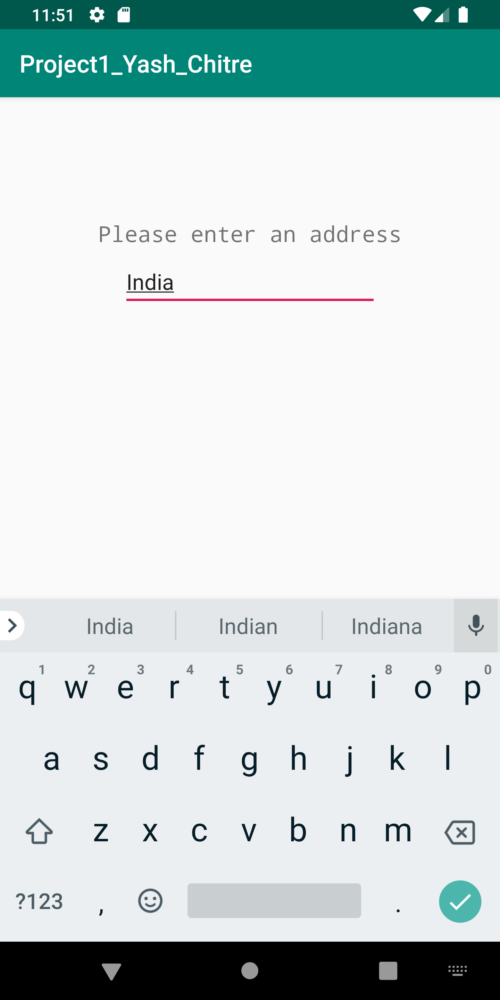
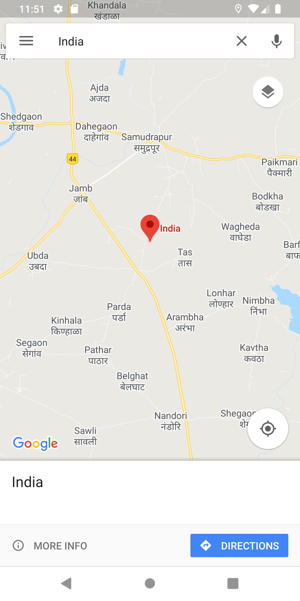

# Map-It Android Application
​	A simple android app that takes an address as input and opens Google Maps for that location.

​	This application shows the use of intents in android apps development.

Refer: [Intents and Intent Filter](https://developer.android.com/guide/components/intents-filters)

​	The app works by pressing the address button to pass an intent, and open the second activity. This is where the user has to enter the address and press enter. This data will be passed back to the activity 1.

Finally, the user is able to press the 'MAP' button to open Google Maps and show the location. The following screenshots shows activity 1, and 2.

